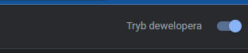

<!-- @format -->

# About the tool

On-Page SEO Analyzer is a sophisticated browser-based utility designed specifically to empower SEO professionals and digital marketers. This tool simplifies the process of conducting comprehensive SEO audits by providing insightful metrics directly from your browser, helping to improve the optimization efforts of any website.

By evaluating crucial SEO elements such as meta tags, title tags, header structure, image alt attributes, and more, On-Page SEO Analyzer provides a quick yet in-depth snapshot of a webpage's SEO health. Its ability to count words and characters offers additional convenience for content creators aiming to optimize their on-page SEO.

On-Page SEO Analyzer also integrates functionalities such as detection of Google Analytics and Google Tag Manager scripts, review of canonical tags, and identification of hreflang implementation for international SEO. This compact, yet powerful tool is an invaluable resource for anyone wishing to streamline their SEO audit process and gain actionable insights.

Whether you're a seasoned SEO expert or a digital marketing beginner, On-Page SEO Analyzer makes it easy to uncover SEO opportunities and areas for improvement on any webpage.

## Quick start - How to Install On-Page SEO Analyzer Locally in Google Chrome

### Step 1: Download and Extract the Extension Files

Download the extension files from the GitHub repository and extract them into a folder on your local machine.

### Step 2: Enable Developer Mode in Chrome

Open the Google Chrome browser and go to the Extensions page. You can reach this page by clicking on the three-dot menu at the top-right corner, then go to More Tools > Extensions, or you can just type `chrome://extensions/` in the address bar and press `Enter`.

On the Extensions page, you will see a toggle switch in the top right corner labeled "Developer Mode". Make sure this switch is turned on.

### Step 3: Load the Extension into Chrome

Click on the "Load Unpacked" button on the top left side of the Extensions page. This will open a file selection dialog. Navigate to the directory where you extracted the extension files and select that directory.

The On-Page SEO Analyzer extension should now appear in your list of extensions. Make sure that the toggle switch in the bottom right corner of the extension box is turned on.

### Step 4: Using the Extension

To use On-Page SEO Analyzer, navigate to any webpage that you want to analyze and click on the On-Page SEO Analyzer icon in the extensions bar at the top right corner of your browser.

The On-Page SEO Analyzer panel will open and start analyzing the webpage, presenting you with a comprehensive SEO audit containing insights on meta tags, title tags, header structure, and more.

## Note

Please ensure to verify the accuracy of the metrics provided by On-Page SEO Analyzer with other reliable SEO resources, as the results can vary depending on several factors. The tool is designed to be a starting point for SEO audits and not the only source of SEO data.

## Conclusion

On-Page SEO Analyzer is an invaluable resource for SEO professionals and digital marketers, providing a quick yet comprehensive snapshot of a webpage's SEO health right in your browser. With its insightful metrics and convenient features, SEO auditing has never been simpler. Happy optimizing!

## Enjoy!
